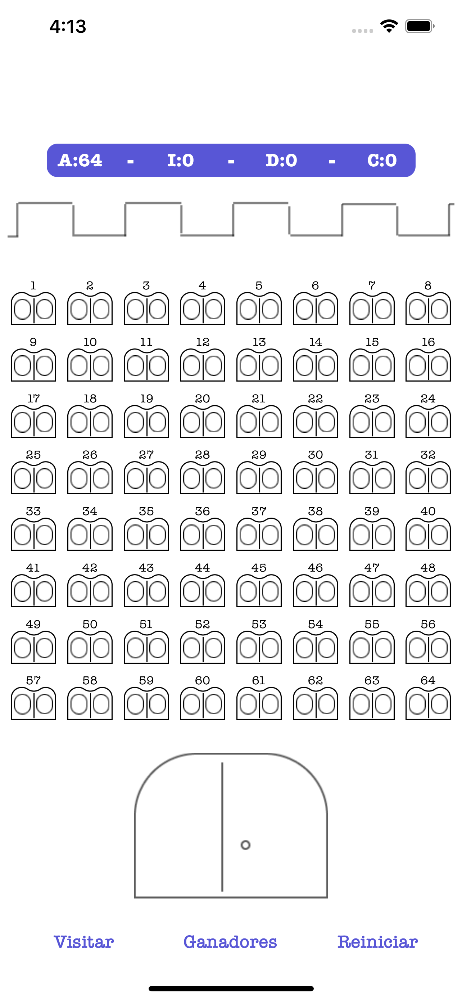

# CastleTest
Esta app está hecha como test técnico en Diciembre de 2020. El enunciado de los requerimientos será especificado en los siguientes puntos.

## Contexto
 - El propietario de un castillo quiere organizar un juego con los visitantes del castillo y hacerles ganar cheques regalo.
 - El castillo posee 64 ventanas con 2 alas, una a la izquierda y otra a la derecha.
 
## Principios
- El propietario reúne a 64 visitantes
- Cada visitante tiene un brazalete numerado de 1 a 64
- Los visitantes pasan por todas las ventanas en orden ascendente
- Los visitantes pasaran en orden ascendente

## Reglas

- El visitante Nº 1 abre las alas izquierdas de las ventanas
- El visitante Nº 2 abre las alas derechas de las ventanas donde el número de la ventana es par
- El visitante Nº 3 abre las alas izquierdas cerradas donde el numero de la ventana es múltiplo de 3, y cierra las alas derechas abiertas donde el número de la ventana es múltiplo de 3
- El visitante Nº 4 abre las alas derechas cerradas donde el numero de la ventana es múltiplo de 4, y cierra las alas izquierdas abiertas donde el número de la ventana es múltiplo de 4
- El visitante Nº 5 abre las alas izquierdas cerradas donde el numero de la ventana es múltiplo de 5, y cierra las alas derechas abiertas donde el número de la ventana es múltiplo de 5
- Y asi hasta el número 64 que abre el ala derecha de la ventana, si esta cerrada y la cierra si esta abierta

## Posición de las ventanas

- Cada ventana esta en una de estas posiciones
- C - Cerrada
- A - Abierta
- I - Ala izquierda abierta
- D - Ala derecha abierta

## Ganadores

- Un visitante gana si la ventana de su numero esta abierta y las ventanas anterior y posterior están cerradas
 
## Ejercicios

- Escriba una función que dado el estado actual de las ventanas devuelva el estado de las 64 ventanas en forma de un array de cadenas después de pasar los 64 visitantes.
- Añada una función para devolver los números de los visitantes que ganaron este juego. El resultado es un array de enteros.
- No hay suficientes ganadores, así que añada una segunda función que modifique la regla para que los visitantes cuyo número de ventana esté abierto (A) que ganen.
- Una vez escritas estas funciones escribir un programa de test iOS donde probarlas, el diseño de la interfaz es libre, pero al menos deberá:
- 1. mostrar el estado de las ventanas
- 2. mostrar cuantas ventanas hay en cada estado 
- 3. el listado de ganadores e permitirá resetear el estado de las ventanas al estado inicial (todas abiertas)
- 4. Se permitirá calcular el paso de los 64 visitantes por las 64 ventanas dado el estado actual de las ventanas.
- 5. Calcular los ganadores mediante las dos reglas descritas en los puntos 2 y 3.

## Captura

